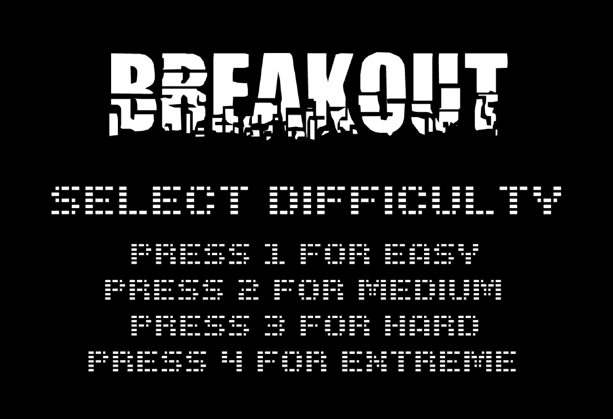
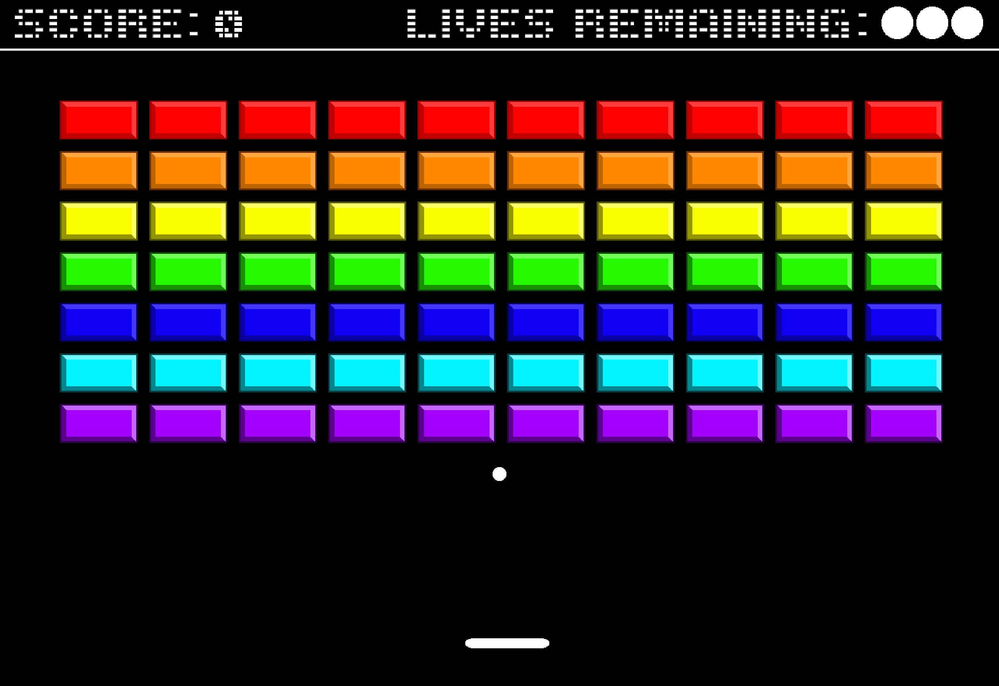
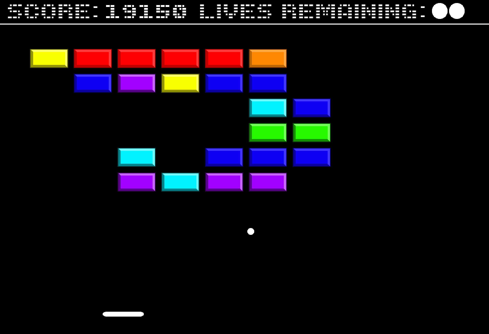
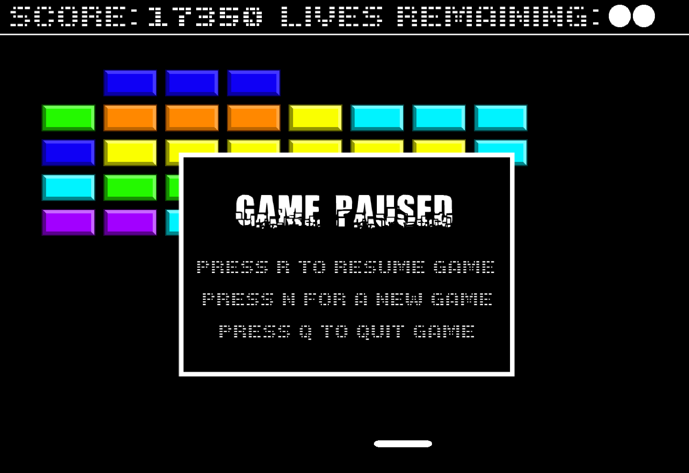
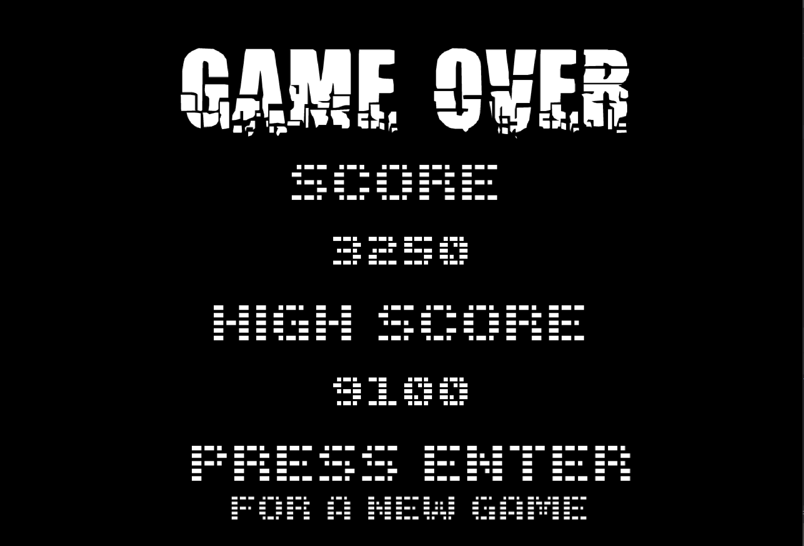
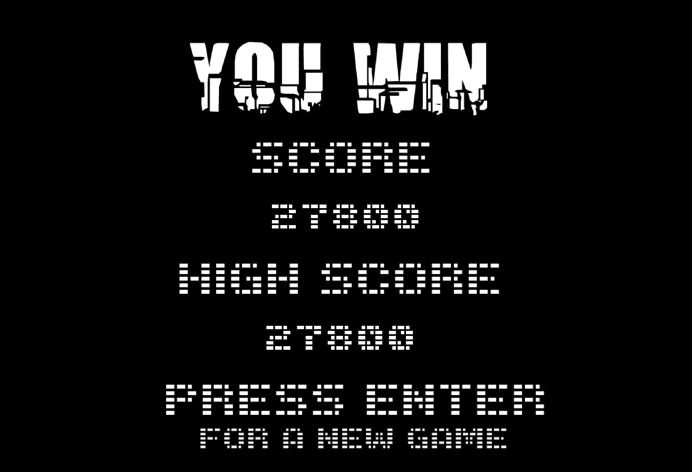

# BreakOut
A version of the classic arcade game BreakOut written in Java using IntelliJ IDEA. The player controls the paddle in order to keep the ball in play and break all of the bricks on the screen.

## Running the Game
Download or clone the repo to your local machine. Run the Frame.java class. This will open a new game window to play the game. Scores will only save for an opened instance of the game. If the Frame.java stops running, the high score will reset.

## Gameplay
### Starting a New Game
When the Frame.java class starts and the game window opens, there is a start screen. The start screen gives the user 4 different difficulty options. Each increasing difficulty option will increase the speed of the ball movement, and the paddle speed will also increase incrementally to match. The four options are:
<ol>
    <li>Easy</li>
    <li>Medium</li>
    <li>Hard</li>
    <li>Extreme</li>
</ol>

Choose a difficulty option and a new game will start. The ball will start moving by default.

### Playing the game
#### Movement
Use the left arrow key (<) to move the paddle left and use the right arrow key (>) to move the paddle to the right. Move the paddle from side to side and keep the ball from falling below the bottom of the screen. If the ball falls below the bottom of the screen, the player will lose one of their lives.

#### Player Lives
The player has a total of 4 lives (the starting life and then 3 additional lives). The number of lives remaining is at the top of the screen. As a life is lost, a ball will be removed from this section to show the current number of lives left. If the player runs out of spare lives, there will be no balls left in the lives remaining section and the ball in play will be the player's final ball.

#### Brick Health
The goal is to keep the ball in play while breaking all of the bricks. The ball will bounce off of the bricks in order to break them. There are 7 different color bricks. Each brick has a different health level. In order to break a brick, the brick's health must be depleted, at which point the brick will be removed off the screen. If a brick with a higher health level is hit but not broken, the color of the brick will change to align with its health status. Below is a breakdown of each brick color and its health level (or how many lives the brick has):
<ul>
    <li>Purple : 1</li>
    <li>Cyan : 2</li>
    <li>Blue : 3</li>
    <li>Green : 4</li>
    <li>Yellow : 5</li>
    <li>Orange : 6</li>
    <li>Red : 7</li>
</ul>

This means after 1 hit, the purple brick will break. After 1 hit, the cyan brick will downgrade to a purple brick. If that brick gets hit again, it will break and be removed. When the blue brick is hit, it will change color to cyan in order to indicate it has 2 hits remaining to be broken, and so on for each brick.

#### Score
Score will be kept and displayed during the game at the top of the window. The factors contributing to a player's overall score are:
<ul>
    <li>Downgrading a brick (not fully breaking a brick) will add 50 points to a player's score.</li>
    <li>Breaking a brick will earn the player 250 points.</li> 
    <li>The player will lose 100 points each time they lose a life.</li>
</ul>
The high score displayed after winning or losing will reflect the player's highest earned score. The high score will be kept for the current Frame.java instance opened. Once closed, high score will be initialized to 0 when a new Frame.java instance is run.

#### Pausing the Game
There is also a pause screen available. Hit the "P" key on the keyboard to open the pause menu. 

On the pause menu, there are three additional options available to the player:
<ul>
    <li>Resume Game: Press the "R" key to resume playing the game (this exits the pause menu and the game will resume from where the play left off).</li>
    <li>New Game: Press the "N" key to exit the current game. The player will be returned to the main menu where they can once again choose what difficulty to play and start a new game. The score from the unfinished game will not be saved, but the current high score will still be saved as long as the current Frame.java instance continues running.</li>
    <li>Quit Game: Press the "Q" key to quit the game. This will stop running the current Frame.java instance and will close the window. The high score will be lost.</li> 
</ul>

#### Game Over
If the player fails to keep the ball in play, they lose the game. The score from the game that just ended will be displayed as well as the current high score.

Pressing the "ENTER" key will return the player to the start screen so that they can select a difficulty to start a new game.

#### Game Won
If all bricks are broken (no more bricks remaining on the screen), the player wins the game. Similarly to the "Game Over" screen, the score for the round will be displayed as well as the current high score.

Again, similarly to the "Game Over" screen, the player can press the "ENTER" key to return to the start screen to start a new game.
